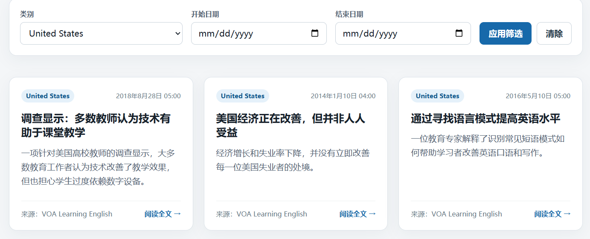
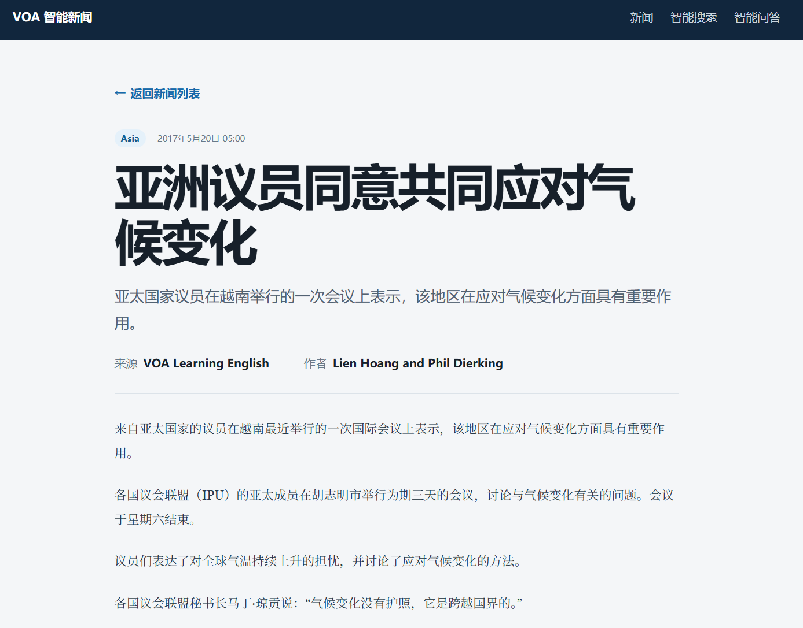
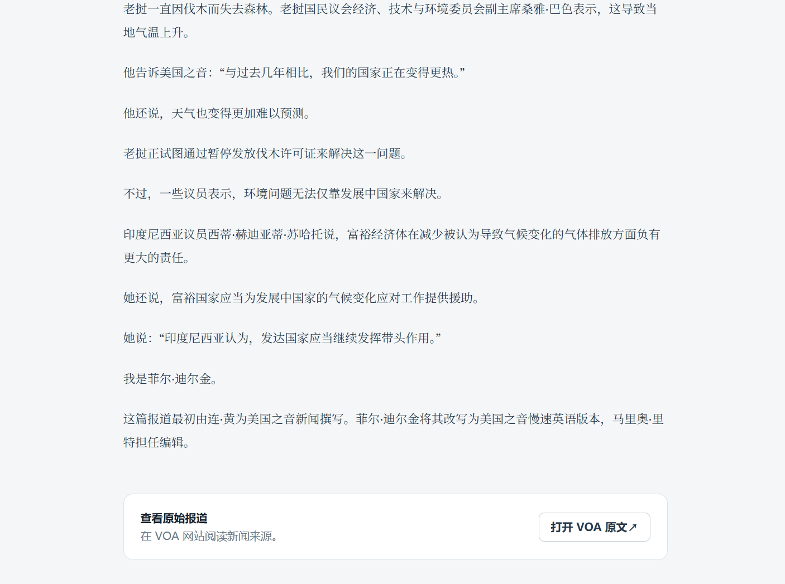
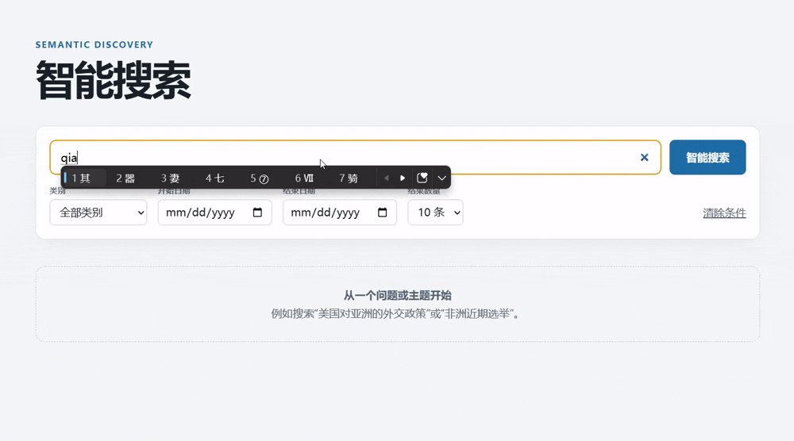
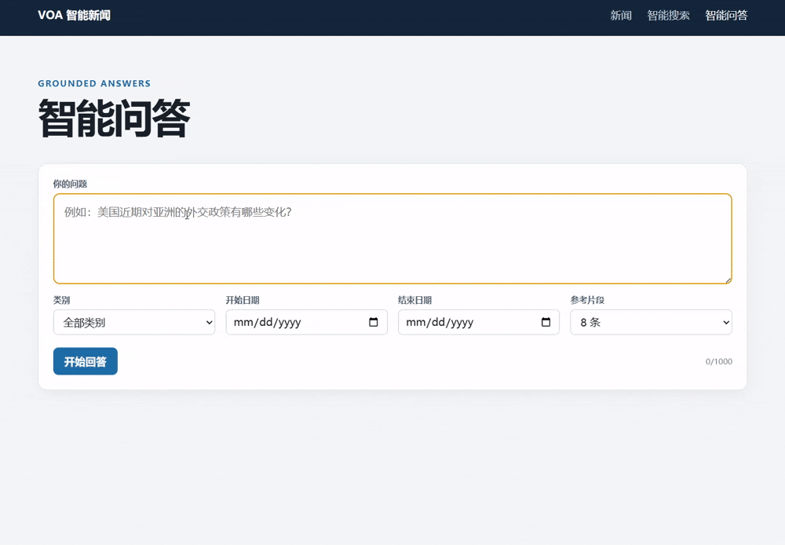

# VOA Smart News

An automated VOA news collection, Chinese translation, semantic search, and AI-powered question-answering system.

The system continuously discovers and processes articles from the VOA website, translates English content into Chinese, and builds a vector index. Users can browse articles like a traditional news website or search and ask questions using natural language.


## Browse News in Chinese

The homepage displays translated and indexed news articles as cards, including the Chinese title, summary, category, source, and publication date.

* Filter by `Africa`, `Asia`, `Politics`, or `United States`
* Filter by start and end dates
* Browse articles with pagination
* Preserve filter settings in the URL for refreshing and sharing
* Automatically handle loading, empty-result, and request-failure states



## Translated Article Details

The article detail page provides a Chinese layout optimized for long-form reading and displays the article summary, author, category, publication time, and source.

Users can open the original VOA report from the detail page or return to the previous news list or search results without losing their browsing position.





## Semantic Search

Smart search does not require the query terms to exactly match the original article text. The system converts the user’s input into a vector and searches for semantically similar passages across the news corpus.

Search results clearly display:

* The title of the matched article
* The most relevant Chinese text passage
* The category and publication date
* A relevance percentage based on cosine similarity
* Highlighted query terms
* A link to the article detail page

Search also supports filtering by category, date range, and number of results, while generating a shareable search URL.



## Streaming Q&A with Source Citations

Users can ask questions directly about the news corpus. The system first retrieves relevant passages, organizes them into controlled context for the LLM, and streams the generated answer to the interface in real time through SSE.

```text
User Question → Semantic Retrieval → News Context Assembly → LLM Generation → SSE Streaming
```

The Q&A interface supports:

* Token-by-token answer streaming
* Manually stopping generation
* Restricting the source scope by category and date
* Numbered citations such as `[1]` and `[2]`
* Clicking a citation to locate the corresponding news passage
* Opening the in-app article detail page or the original VOA report from a citation
* Clearly indicating whether the answer is supported by news evidence
* Detecting interrupted or incomplete data streams



## Traceable Answer Sources

Each cited source includes the article title, relevant passage, category, publication date, and relevance score. Citation numbers in the answer map directly to the corresponding source cards, allowing users to quickly verify the evidence instead of relying solely on the model-generated conclusion.

When the news corpus does not contain sufficient evidence, the interface clearly displays “Insufficient Evidence” rather than presenting an unsupported answer as a confirmed fact.

